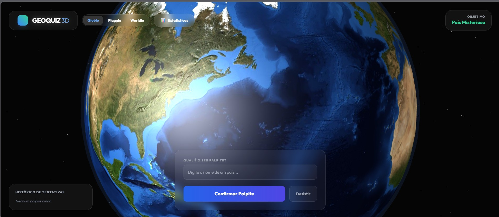

# 🌍 Geo-Quiz 3D

O **Geo-Quiz 3D** é uma plataforma imersiva de desafios geográficos que combina a precisão de um backend em Java com a interatividade de um globo 3D renderizado em tempo real. Os jogadores podem testar seus conhecimentos em três módulos distintos, acompanhando seu progresso através de um dashboard detalhado.

---

## 🎮 Modos de Jogo

### 🌎 Globle (Clássico)

O desafio definitivo de busca. Dê palpites de países e receba feedback instantâneo de distância e direção no globo 3D. O calor das cores indica quão perto você está do alvo.

### 🚩 Flaggle

Teste sua memória visual. Uma bandeira é exibida com um efeito de desfoque (*blur*) que diminui a cada palpite errado. Consiga identificar o país antes da revelação total!

### 🗺️ Worldle

Identifique o país apenas pela sua silhueta geográfica. Renderizado via SVG dinâmico, este modo desafia o reconhecimento de fronteiras e formas territoriais.

---

## ✨ Funcionalidades Premium

* **Globo 3D Interativo**: Navegação fluida com zoom e transições cinematográficas suaves entre palpites.
* **Dashboard do Explorador**: Visualize suas estatísticas globais, conquistas por continente e mapa múndi de países descobertos.
* **Inteligência Geográfica**: Motor de cálculo baseado nas fórmulas de Haversine e Bearing para precisão milimétrica.
* **Design Futurista**: Interface baseada em *Glassmorphism* com tema Neon/Dark, totalmente responsiva para dispositivos móveis.
* **Persistência de Sessão**: Reinicie jogos instantaneamente e mantenha seu progresso sem recarregar a página.

---

## 🛠️ Tecnologias Utilizadas

### Backend

* **Java 17 / Spring Boot 4**: Núcleo da aplicação e APIs REST.
* **Spring Data JPA / PostgreSQL**: Persistência de países, usuários e conquistas.
* **Lombok**: Otimização de boilerplate code.

### Frontend

* **Three.js**: Engine 3D para o globo e estrelas.
* **Tailwind CSS**: Estilização moderna e responsiva.
* **Tween.js**: Animações suaves de câmera.
* **Google Charts**: Visualização de dados e mapas de calor.
* **Thymeleaf**: Mecanismo de templates para integração SSR.

---

## 📸 Preview

---

## 📄 Licença

Este projeto está sob a licença MIT. Veja o arquivo [LICENSE](LICENSE) para mais detalhes.

---

### Desenvolvido por Caique Novaes

---

> **"O mundo na palma da sua mão. Desafie seus limites geográficos em uma experiência 3D única."**
